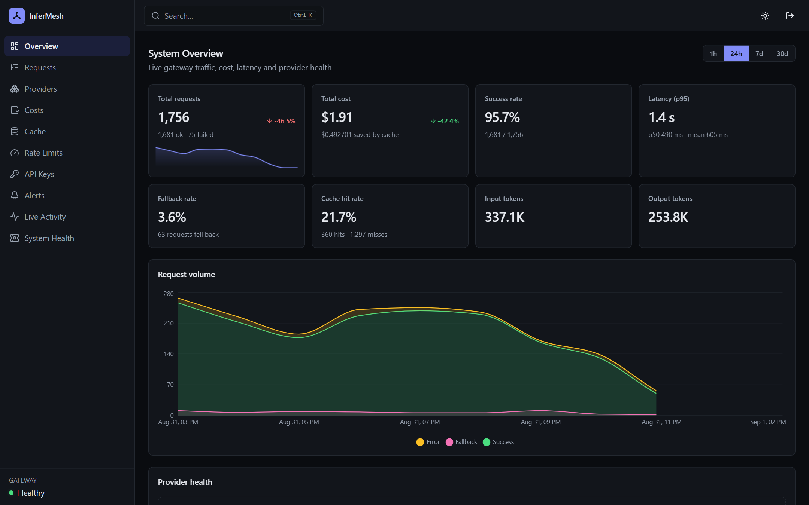
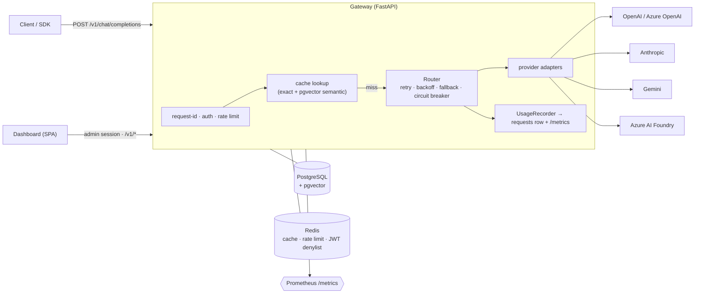
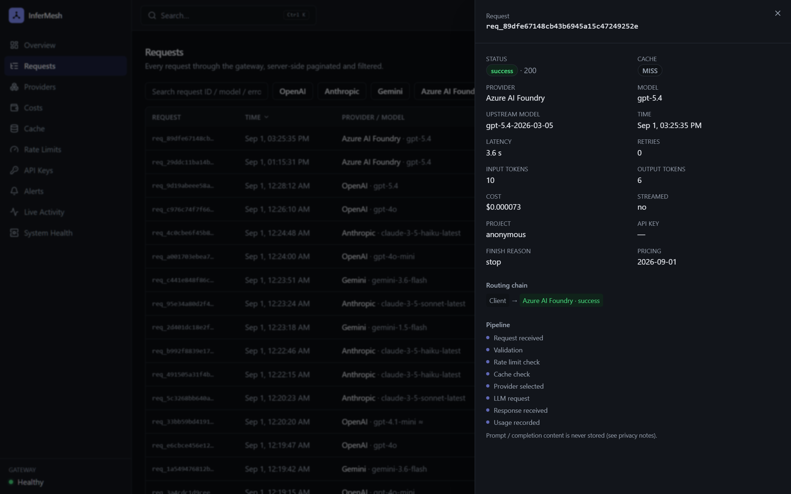
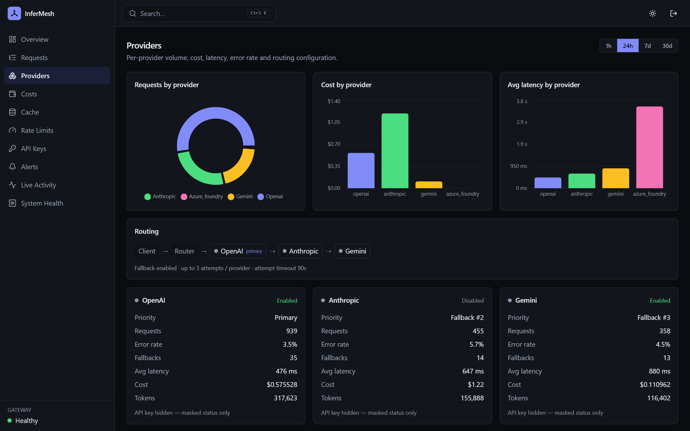
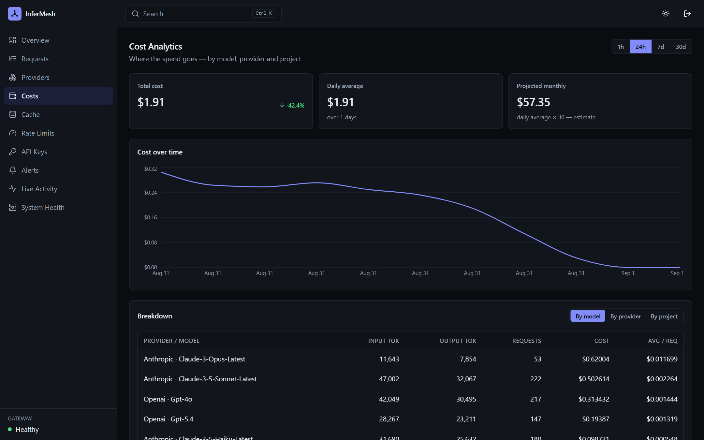
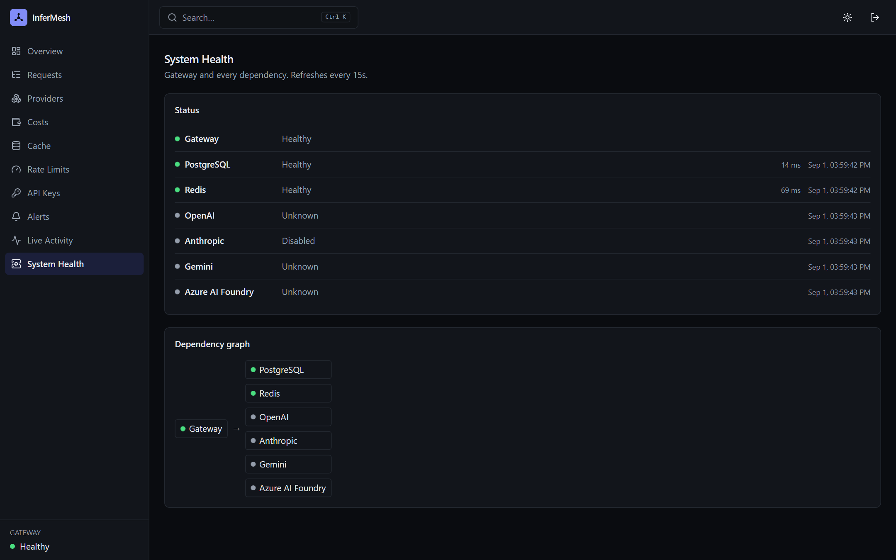
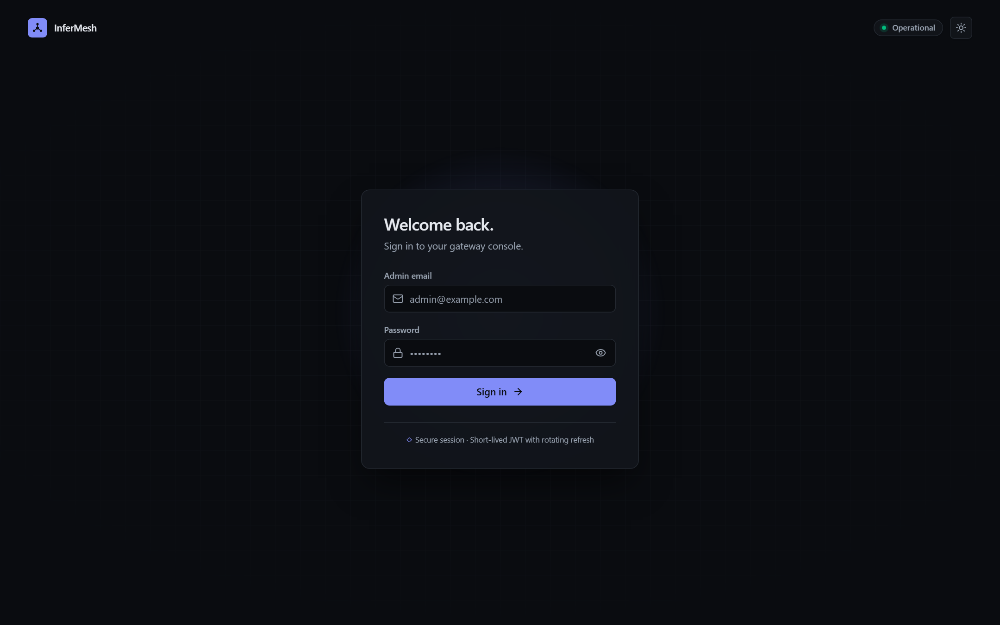

# InferMesh — Multi-Provider LLM Gateway & Observability Platform

A production-shaped LLM gateway that routes OpenAI-compatible chat-completion
requests across **OpenAI / Azure OpenAI, Anthropic, Google Gemini, and Azure AI
Foundry** with retries, fallback, response caching and rate-limiting — plus a
React/TypeScript observability dashboard ("InferMesh") that runs entirely off real
gateway data.

The build is complete (12 phases — see [`PROGRESS.md`](./PROGRESS.md)). Spec and
phase definitions live in [`docs/SPEC.md`](./docs/SPEC.md); a new session starts
from [`CLAUDE.md`](./CLAUDE.md).



## What's in it

- **Gateway** — one OpenAI-compatible `POST /v1/chat/completions` (SSE too) in
  front of four providers, with per-provider retry + exponential backoff,
  fallback across an ordered chain, a **per-provider circuit breaker**, exact +
  semantic response caching, and Redis sliding-window rate limiting. Every
  response carries a `gateway` metadata object (provider used, cache status,
  fallback chain, retries, latency, cost).
- **Observability** — every call writes one `requests` row; the dashboard's
  ~15 pages are pure SQL aggregation over it (`percentile_cont`, `date_bin`,
  window functions). Prometheus metrics at **`GET /metrics`**; build provenance
  at `GET /v1/version`.
- **Dashboard** — React 19 / Vite / Tailwind v4, route-level code-split, dark +
  light, WCAG 2 AA (0 critical/serious axe violations), ⌘K palette, CSV export.
- **Ops** — `docker compose --profile full up` runs the whole stack (nginx +
  SPA + gateway + Postgres + Redis); CI runs backend / frontend / Playwright E2E
  / image builds.

## Architecture



## Repo layout

```
backend/            FastAPI gateway — Python 3.13, async SQLAlchemy, Redis, uv-managed
frontend/           React + TypeScript dashboard — Vite, Tailwind v4, TanStack Query
docker-compose.yml  local infra (postgres + redis) + backend + optional seed service
.env.example        every environment variable the stack reads
docs/SPEC.md         verbatim project spec (§30 phase list, Definitions of Done)
docs/screenshots/    dashboard screenshots used in this README
PROGRESS.md          per-phase build log (plan / done / deviations / verification)
```

## Prerequisites

| Tool | For |
|------|-----|
| Docker Desktop (running) | Postgres + Redis |
| [`uv`](https://docs.astral.sh/uv/) | backend Python env |
| Node 20+ | frontend |

Provider credentials go in `backend/.env` (gitignored). `.env.example` documents
every variable; copy it and fill in whatever keys you have — the gateway enables
each provider only when its credentials are present.

---

## Run it

### 1. Infrastructure

```bash
docker compose up -d postgres redis
```

### 2. Backend

```bash
cd backend
uv sync                                   # first time
uv run alembic upgrade head               # create tables
uv run python -m scripts.seed --truncate  # ~100k realistic historical rows

# start the gateway (Git Bash on Windows: load .env first)
set -a && . ./.env && set +a && export AUTH_COOKIE_SECURE=false
uv run uvicorn app.main:app --port 8000
```

Gateway → **http://127.0.0.1:8000** (`GET /health`, `GET /health/ready`,
`POST /v1/chat/completions`, admin `GET /v1/...` dashboard APIs).

### 3. Frontend

```bash
cd frontend
npm install          # first time
npm run dev          # http://localhost:5173
```

Open **http://localhost:5173** and sign in with the admin credentials from
`backend/.env` (default `admin@example.com` / `admin-dev-password`). The dev
server proxies `/v1` and `/health` to `127.0.0.1:8000`, so the browser sees one
origin — first-party session cookie, no CORS.

### 4. Send a request through the gateway

```bash
curl -sS localhost:8000/v1/chat/completions \
  -H 'content-type: application/json' \
  -d '{"provider":"azure_foundry","model":"gpt-5.4",
       "messages":[{"role":"user","content":"Say pong."}],"max_tokens":32}' | jq
```

The response is an OpenAI-compatible body plus a `gateway` object (request id,
provider used, cache status, fallback chain, retries, latency, cost). It shows up
immediately on the dashboard's **Live Activity** page — open its row for the
detail drawer.

Add `"stream": true` for Server-Sent Events: OpenAI-compatible
`chat.completion.chunk` frames, a final frame with `finish_reason` / `usage` /
`gateway`, then `data: [DONE]`. Retry and fallback apply only before the first
token; the usage row is still written when the stream ends.

### Run the whole stack in Docker

```bash
cp .env.example backend/.env                    # fill in provider keys
docker compose --profile full up --build        # postgres + redis + backend + dashboard
docker compose --profile seed run --rm seed --rows 100000 --truncate
```

- Dashboard (nginx serving the built SPA, proxying the API): **http://localhost:8080**
- Gateway directly: **http://localhost:8000**

`docker compose up --build` (no profile) runs everything except the dashboard;
`docker compose up -d postgres redis` is just the infra for host-side `uv run` /
`npm run dev`. The backend image runs `alembic upgrade head` on start (retried
until Postgres is up), then `uvicorn`. Pass `GIT_SHA` / `BUILD_TIME` as env to
stamp `GET /v1/version`.

---

## Providers

Selected per request via the `provider` field, or picked automatically by the
fallback chain. Each is enabled only when its credentials are set.

| id | API | credentials |
|----|-----|-------------|
| `openai` | OpenAI, or Azure OpenAI when `OPENAI_MODE=azure` | `OPENAI_API_KEY` (+ `AZURE_OPENAI_*`) |
| `anthropic` | Anthropic Messages | `ANTHROPIC_API_KEY` |
| `gemini` | Google `google-genai` | `GEMINI_API_KEY` |
| `azure_foundry` | Azure AI Model Inference (`<res>.services.ai.azure.com/models`) | `AZURE_FOUNDRY_ENDPOINT` + `AZURE_FOUNDRY_API_KEY` |

`azure_foundry` is a distinct provider from `OPENAI_MODE=azure` — it targets the
unified Foundry `/models` inference surface (its own api-version and deployments).
See `backend/README.md` for the full provider and configuration reference.

---

## Test it

### Backend

```bash
cd backend
uv run ruff check . && uv run ruff format --check . && uv run mypy && uv run pytest
```
→ **156 passed, 8 skipped** (the 8 are live-provider tests that self-skip with no keys).

```bash
# live provider tests (optional — hits real Azure/Gemini)
set -a && . ./.env && set +a && uv run pytest -m live

# migration round-trip
uv run alembic upgrade head && uv run alembic check \
  && uv run alembic downgrade base && uv run alembic upgrade head
```

### Frontend

```bash
cd frontend
npx tsc -b --noEmit && npm run build && npm run lint && npm run test
```
→ tsc clean · build ✓ · oxlint 0 warnings · **28 Vitest** unit/component tests.

### End-to-end (Playwright)

Needs Postgres/Redis up **and the DB seeded** (Run-it steps 1–2). Playwright boots
the gateway and Vite itself.

```bash
cd frontend
npx playwright install chromium     # first run (~115 MB)
npm run e2e
```
→ **25 tests** — the spec §31 journey (login → filtering → details drawer → cost
breakdown → provider health → theme switch → live activity → API-key
create/revoke → error states), a per-page axe accessibility scan (0
critical/serious WCAG2 A/AA violations), plus perf and responsive specs.

```bash
PW_NO_SERVER=1 npm run e2e           # against an already-running stack
npx playwright show-report           # HTML report from the last run
```

### CI

`.github/workflows/ci.yml` runs it all on push / PR: `backend` (ruff → format →
mypy → alembic up/check/down/up → pytest), `frontend` (tsc → lint → vitest →
build), `e2e` (services → seed → Playwright, report uploaded as an artifact), and
a `docker build` of the backend image.

---

## Measured performance (100k-row seed, spec §32)

- Dashboard **Overview → first KPI value rendered: ~0.55 s** (target was sub-2s).
- **Requests explorer next page (server-paginated over 100k rows): ~0.15 s.**
- Backend aggregation endpoints: **< ~80 ms server-side**.
- Production frontend bundle: main chunk **~95 kB gzip** after route-level code
  splitting (Recharts is a separate on-demand chunk).

---

## Screenshots

| | |
|---|---|
|  |  |
| **Requests explorer** — filters, sort, CSV export, routing-chain drawer | **Providers** — health, circuit state, routing config |
|  |  |
| **Cost analytics** — trend + breakdown by model / provider / project | **System health** — gateway + every dependency, circuit states |

The sign-in screen: 

---

## Non-goals (intentional — see spec §1)

- Multi-user / RBAC for the dashboard — it's a single-admin tool by design.
- A generic microservices split — one backend, one frontend, Postgres, Redis.
- A general-purpose chat UI — the frontend is an operations dashboard.
